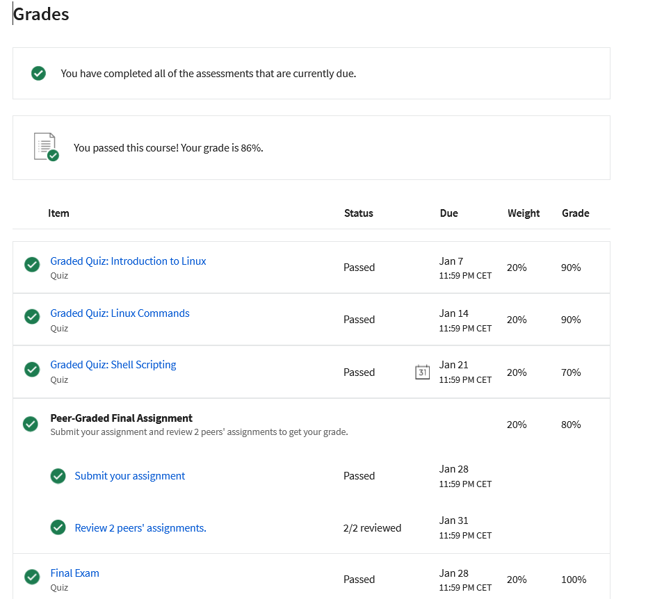

Welcome to my Linux Commands and Shell Scripting repository! 🚀 This repository is a comprehensive collection of commands, scripts, and resources I've gathered during my IBM course on Coursera. From foundational Linux commands to advanced shell scripting, you'll find practical examples, directory structures, and networking snippets.

Key Features:

    📚 Foundational Linux Commands
    🖥️ Shell Scripting Examples (Simple to Advanced)
    📂 Directory and File Management Techniques
    🔐 Access Control Commands and Permissions
    🌐 Networking Commands
    🕒 Cron Job Scheduling

Feel free to explore, learn, and contribute. Whether you're a beginner or an experienced user, this repository aims to be a valuable resource on your Linux journey. Happy coding! 👩‍💻👨‍💻
# Badge Provided whith this course : 
    Linux_Commands_Shell_and_Scripting_Essentials :
This badge earner has demonstrated a foundational knowledge of Linux commands and shell scripting. The individual can perform general-purpose, directory management, file management, access control commands, and networking commands. The badge earner has hands-on experience creating simple and advanced shell scripts and scheduling cron jobs using crontab. The earner knows the frequently used commands and shell scripting basics required to become a successful data engineer.
This is my personal grades from this course :

